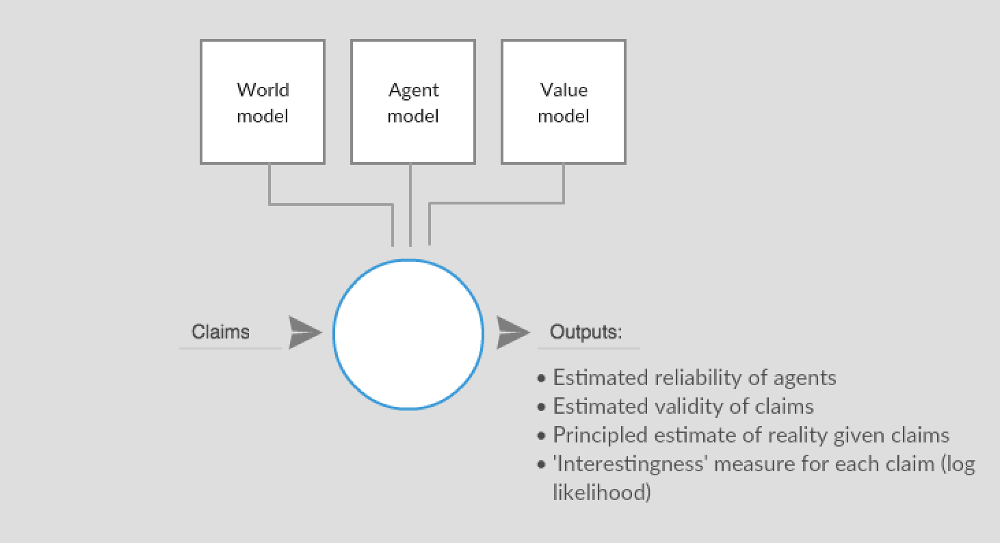
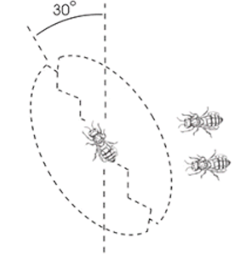

### Agents and claims

We consider problems involving a collection of agents making claims where we want to jointly infer the **accuracy** of those claims as well as the **reliability** of the agents. 

Getting reliable information from a network of (potentially) unreliable agents is a problem with applications in crowdsourcing, collective intelligence, loan allocation, disaster response and intelligence, targeting of aid, and many other areas. 

In some of these contexts it also useful to be able to estimate, in a principled way, the number of bits of useful information contained in a message so that the most **important** claims can be processed first.

We consider a collection of agents  and a set of claims . Each claim has three parts:
 - an _*index*_, i (what the claim is about)
 - a _*signature*_, a (the agent which makes this claim)
 - a _*value*_, x (a numeric, or categorical, measurement)

Examples of claims :
- That the barometric pressure at index i, (latitude, longitude, time), has value, x, as measured by the given weather gauge, a
- That an agent will not default on a specified loan, i, as claimed (promised) by that agent, a
- That an agent, b, has a probability of default, x, on a specified loan i, as estimated by another agent, a
- That the bridge at location i is 'at risk of over topping', as observed by agent a 
- That in a claim made by an agent b, being generally consistent with other valid information held by agent a, has a validity, x as estimated by that agent

We also aim to ascribe a property _*validity*_ to all claims, where . In the case of claims about measurable reality we define this as the probability that an 'objective measurement' made at index i will return (or would have returned) the same value, x as in the claim. 

As we shall see, it is not always necessary to directly measure v in order to be able to usefully reason with it, as we can sometimes infer its value from data.

### World model, agent model, measurement model 

In the general case, claims are independent and the inference as described above is impossible. However, for domains where we can build (or assume) models that constrain the degrees of freedom, some useful inference is possible. Such constraints generally fall into three areas:
- *world model*
- *agent model*
- *measurement model*

A **world model** is domain specific and describes how claims made at one index relate to claims made at another index. For example, if  weather gauge measurements are indexed by <latitude, longitude, time> a simple world model might note that nearby measurements tend to be similar. A more complex world model might take into account weather patterns and their tendency to move across space and time in various ways. Whether complex or simple, the world model can be used to spot measurements at one gauge that are inconsistent with the bulk of data from other 'nearby' gauges. These inconsistent measurements are said to be 'surprising'.

An **agent model** describes how the claims made by one agent relate to claims made by other agents. 

For example in [Bachrach, Yoram, et al. "How to grade a test without knowing the answers---a Bayesian graphical model for adaptive crowdsourcing and aptitude testing." (2012).](https://icml.cc/2012/papers/597.pdf) they describe a Bayesian model with a latent variable called 'ability' attached to each student. To adapt our model to this scenario, we might consider agents to be the students taking the test, the index to be the question asked, the value, x, to be the answer given by the student and validity to be whether or not the answer was correct. In this case, ability creates a fixed variance or accuracy over student answers. Some agent models ascribe a latent precision as well as an accuracy to agents. More complex agent models may group agents into classes such as in [Venanzi, Matteo, et al. "Community-based bayesian aggregation models for crowdsourcing." Proceedings of the 23rd international conference on World wide web. ACM, 2014](https://dl.acm.org/citation.cfm?id=2567989)

A **measurement model** describes how the measurement, x, for a given agent given a particular index is distributed. 

The measurement model describes how the world is represented inside the model. In the simplest case, such as a rain gauge, the measurement model is the accuracy and precision with which rainfall is  measured. In the waggle dance carried out by bees, if the world is the distribution of flowers and the time of day, the measurement model described how that relates to the waggle dance. 

--

When the domain is constrained, it is possible to infer information about the world, and about the agents. In particular, external validation (such as calibration measurements, or example answers) may not be required. In a simple case, Bayesian modeling can be used to infer both the agent reliability and the claim accuracy in a principled way from observed data.

Furthermore, we can measure the log likelihood of a claim as a proxy for the 'importance' of that message. For instance, given an agent, world, and measurement model, an otherwise surprising claim from a reliable source has a low likelihood and therefore should be considered 'important'. By  contrast, surprising claims (per the world model) from unreliable sources have a higher likelihood and can therefore be considered to contain fewer bits of information and be less important.

We hope to build a general model that, given a stream of messages as well as an appropriate world, agent and measurement models can provide the following outputs in a general way.

### Networks of agents (channeled communication)

So far, we have assumed a 'god view' where we have access to all claims from all agents. In practice, however, we may only be connected to a limited number of agents. 

For various reasons we believe it may be useful to consider a network of agents where every agent is performing these kind of evaluations on the messages received from other agents and then preferentially emitting what they consider to be important, valid messages. Each agent may also be initiating measurements or claims. In such a case we can consider the entropy of the system as a whole.

Early investigations suggest that when the 'reality' is held fixed, the messages sent by the network of agents eventually settles to a low-entropy equilibrium with low activity, but jumps to a high activity as soon as the underlying reality changes and measurements become low likelihood.

We also wish to explore how resistant such a network would be to 'rogue' agents who, whether through malice or incompetence, tend to emit claims of low validity, and how we can refine the agent and world models to make the overall network more resistant to such attacks.

### Some example domains 

**The waggle dance**

-  Agent model = bees are trustworthy 
-  World model = flowers have pollen at specific locations 
-  Measurement model = the waggle dance is used to communicate where the pollen is at 

**Self grading test / crowd sourcing generally**

- Agent model = student aptitude
- World model = no correlation between questions
- Measurement model = some questions are harder than others
- Validity = answer is correct 

**Claims about claims**

- Agents can say they attended a meeting or that they didn't
- Other agents can confirm those claims  
- World model = meeting attendance claims should be consistent in that agents can accurately confirm another's attendance at a meeting if they were in attendance themselves
- Measurement model = exchange of keys provides verifiable truth, lowers expected variance in such case
- Agent model = agents should be 100% correct on their own attendance or be considered untrustworthy
- Validity = objective truth 

